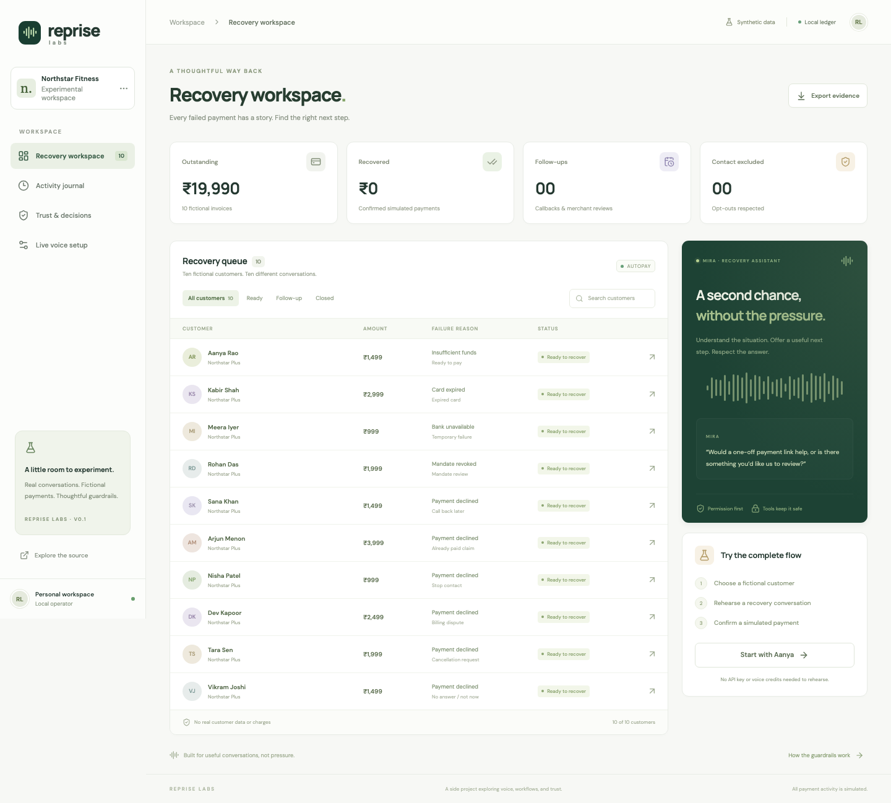

# Reprise Labs

**A second chance, without the pressure.**

A side project exploring voice agents, failed subscription payments, and the boundary between a helpful conversation and an authorized action. Reprise gives a merchant a recovery workspace, a Bolna voice agent named Mira, ten fictional customer records, and a small set of server-enforced tools.



Try the full workflow without credentials or paid voice credits. Rehearsals exercise the same recovery policies as live calls; their conversations are explicitly scripted. Live mode makes a real phone call to one privately configured, permitted test number. All payments are simulated.

## Run locally

Requires **Node.js 22.13+** (Node 24 recommended) and npm. SQLite is built into Node; no hosted database or other service is needed for rehearsal mode.

```sh
git clone https://github.com/mssharatchandra/reprise-labs.git
cd reprise-labs
npm ci
npm run setup
npm run dev
```

Open **http://localhost:4173**. Choose Aanya → Start rehearsal → grant permission → create a payment link → open simulated checkout → confirm payment. The workspace records recovery only after checkout confirmation. Try Nisha for opt-out, Arjun for claimed prior payment, Dev for a dispute, and Rohan for a revoked mandate.

For the production bundle:

```sh
npm run build
npm start
```

Local state persists in `.local/reprise.db`. For a clean, independent workspace set `DATABASE_PATH=.local/another-demo.db` before starting. Do not reset a ledger used for live calls: it also holds their spend reservations and exclusion state.

## Real voice setup

1. Run `npm run setup`, then edit the **ignored** `.env.local`. Add your Bolna API key and set `DEMO_PHONE_NUMBER` to **one number you control or have explicit permission to call**, in E.164 format. Keep both private. `OPERATOR_TOKEN` and `PROVIDER_TOOL_SECRET` are generated locally.
2. Build and start the production server with `npm run build` then `npm start`. Start a public HTTPS tunnel, for example `cloudflared tunnel --url http://localhost:4173`. Set `APP_BASE_URL` to the returned HTTPS URL in `.env.local`. Development file/HMR middleware is local-only; public UI requires the production server.
3. Run `npm run agent:provision` once. This creates a dedicated agent and writes its ID to the private environment. It does not modify other agents or place a call. Restart the app to load the changed environment.
4. Run `npm run provider:check`, or click **Verify agent configuration** in Live voice setup. Reprise checks the six authenticated tool destinations, the LLM model, and the 90-second duration cap.
5. Choose a fictional customer, click **Call my test number**, and confirm ownership/permission. Answer the real phone, grant conversational permission, and request a simulated link or callback. The configured destination is never shown in the browser and cannot be supplied through the call API.

If a tunnel changes, the agent URLs must change too. Generate a private reviewable configuration with `npm run agent:export -- --private`, apply it to the dedicated agent through the provider, restart, and verify again. The private export stays in `.local/`; **never upload it**. The shareable [template](artifacts/bolna-agent.template.json) contains placeholders only.

Bolna supplies the LLM, transcription, speech synthesis and outbound telephony. The current configuration uses GPT-4.1 mini, Deepgram Nova 3 and ElevenLabs Angelica. Provider availability, verified-destination restrictions, routing and billing depend on your account. A free rehearsal does not validate those services.

**Budget:** default $2 application allowance, with a conservative $0.50 reservation for every live attempt and a 90-second call cap. Reservations are retained even if acceptance is unknown or the number is busy. No automatic redial. This caps attempts through this workspace; it is **not a provider-enforced dollar limit**. Provider-native cost is recorded without assuming its currency. Verify your account’s actual pricing independently.

The public tunnel shows a locked operator workspace. Use the private `OPERATOR_TOKEN` locally to unlock it if needed. Provider tools require a separate bearer secret **and** a capability bound to a single live conversation. Checkout pages expose fictional invoices only and move no real money.

## What is included

| Surface            | Behavior                                                                                                      |
| ------------------ | ------------------------------------------------------------------------------------------------------------- |
| Recovery workspace | Search/filter ten customers, inspect context, run a rehearsal or permitted live call                          |
| Mira               | Discloses AI/demo identity, asks permission, offers a bounded next step                                       |
| Six recovery tools | Read context, record permission, create simulated checkout, record callback, opt out, request merchant review |
| Checkout           | One-off simulated settlement with an idempotent receipt; autopay stays unchanged                              |
| Activity journal   | Timestamped accepted actions and provider execution outcomes                                                  |
| Trust & decisions  | Policy boundaries and honest separation of rehearsal/live evidence                                            |
| Live setup         | Actual readiness checks, verification and retained budget reservations                                        |
| Evidence export    | Synthetic records, redacted transcripts and events; no credentials or destination                             |

## Verify

```sh
npm test                         # 28 policy / API / provider boundary tests
npm run eval                     # ten scripted scenarios, zero provider calls
npx playwright install chromium  # once, for browser tests
npm run test:e2e                  # four browser workflows; independent DB, live calling disabled
npm run build                    # strict TypeScript check + production build
```

The [evaluation artifact](artifacts/evaluation.json) contains reproducible synthetic transcripts and events. It measures deterministic policy behavior, **not LLM quality**. See [verification](docs/verification.md) for observed transport results and evidence boundaries; see [architecture](docs/architecture.md), [tools](docs/tools.md), [demo guide](docs/demo.md), and [dlogs notes](docs/dlogs.md) for the design and experiment.

An actual permitted **77-second answered call** exercised consent → simulated link → final provider transcript. Its link was then settled through browser checkout. The [live evidence](artifacts/live-evidence.json) omits private data; the [short product walkthrough](artifacts/product-walkthrough.webm) separately records the scripted browser experience.

## Boundaries and next steps

This is a single-operator prototype. It cannot collect money, retry an actual debit, modify a recurring mandate, cancel a subscription, issue a discount/refund, send messages, automatically dial callbacks, or transfer a call to a human. A claimed prior payment creates a review task rather than changing payment truth. Rehearsal guardrail responses are scripted; model behavior needs separate recorded live evaluations.

For a merchant rollout: integrate a real gateway with authenticated settlement events, approved message delivery and verified account ownership; add merchant authentication/RBAC, tenant isolation, consent retention policies, operator reconciliation, controlled retries, observability, deployment and a queue. Replace the temporary tunnel with a stable HTTPS service. Evaluate ASR/latency, interruption, ambiguous consent, tool fidelity and multilingual behavior using permitted calls before scaling.

No real customer dataset or credentials are included. All customer names, emails, balances and scenarios are fictional.
