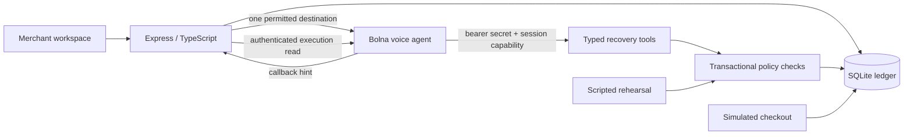

# Architecture

The first useful slice is a complete merchant workflow: understand a failed renewal, ask permission, offer a bounded next step, and distinguish a promise from a confirmed payment. More aggressive recovery is not necessarily a better outcome: disputes, revoked mandates and stop-contact requests need a different path.

React/Vite provides the workspace; Express serves it and the API from one origin. Node’s built-in SQLite stores customer state, sessions, private capabilities, links, semantic action receipts, an event journal and configuration verification. Integer paise avoids floating-point financial totals. Mutations use `BEGIN IMMEDIATE` transactions.

Every provider tool uses a secret shared only by the server/provider and a random capability bound to one live session. A caller cannot select another customer, override an amount, or settle an invoice through tool arguments. Zod rejects unknown fields. Opt-out, merchant review and settled-payment checks supersede stale recovery receipts. Request signatures reject idempotency-key reuse for another operation/session.

A payment link remains pending until the separate simulated checkout adapter confirms it. Checkout is idempotent. A voluntary settlement after opt-out preserves the opt-out; review blocks unsettled checkout. There is no inference from an LLM summary or claimed prior payment to financial state.

The voice request reserves budget before contacting the provider. An unknown request outcome stays in reconciliation and retains its reservation; the app refuses a second simultaneous live call. Accepted execution IDs are reconciled using authenticated provider reads. Callback payloads cannot directly mutate payment state. Agent/execution binding rejects mismatches, and terminal state does not regress when notifications arrive out of order.

The loopback workspace trusts the local machine. Public hosts require an operator bearer token; local-origin checks prevent a cross-origin browser from using local operator privileges. Separate provider authorization, rate limiting, body-size limits, redacted free text, and restricted destinations reduce accidental exposure. This is not tenant isolation or enterprise authentication.

Rehearsal uses the same policy functions as live tools, but its scripted text is not an LLM evaluation. Persistence and deterministic tests are deliberately local so a reviewer can exercise the complete product without billing credentials. A real voice demonstration additionally requires provider configuration, public HTTPS reachability and an answered permitted call.
